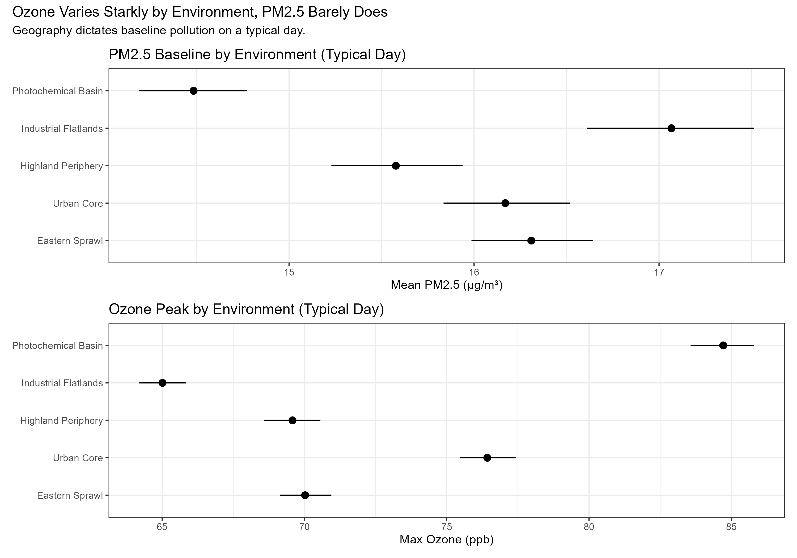
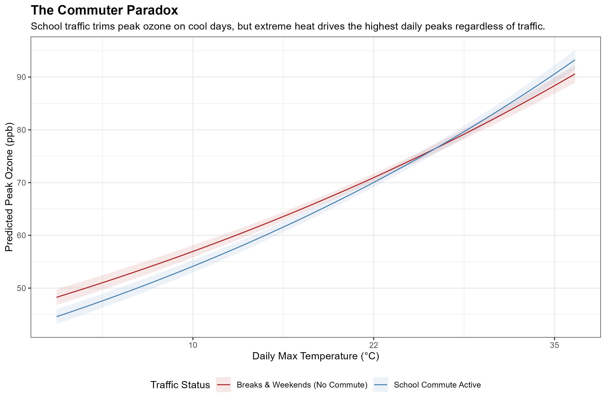
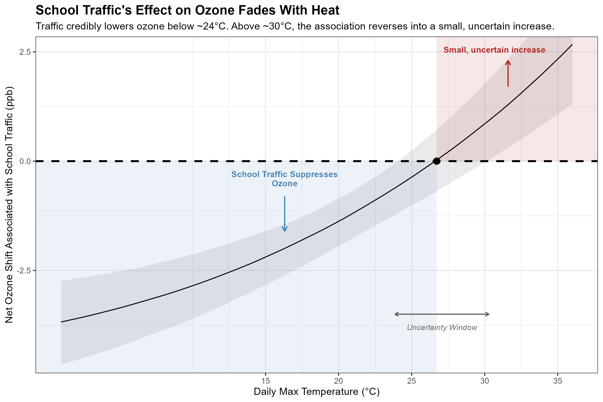
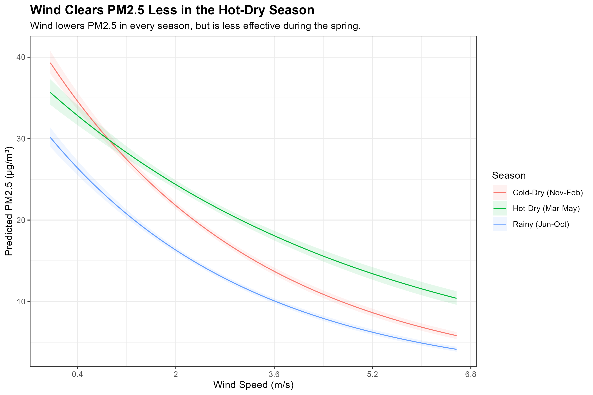

*By [Hector Ruiz](https://www.linkedin.com/in/hector-ruiz-g/)*

In 2023, my three-year-old caught a respiratory bug that turned into pneumonia. We spent a week in the hospital. Listening to the rhythmic hum of the monitors in the ward, I felt a very specific kind of exhaustion and anxiety. It was the terrifying realization of a fear most parents in the city already carry when the gray haze settles heavily over the valley. 

But fear is paralyzing, and it isn't a practical daily strategy. We navigate a city where millions of people commute for hours across the basin. We pack into the Metro and drive our kids to schools far from home because that is the reality of our geography and our economy. We cannot individually change the topography, and most of us cannot simply relocate. We live where we live.

What we can do is understand the invisible machine we are breathing. I analyzed five years of hourly atmospheric data from the city's monitoring networks. Because physical sensors frequently break during extreme weather, I had to mathematically bridge thousands of hours of missing telemetry to rescue the historical record. By patching these millions of data points together, we can map exactly how weather and traffic interact in our specific neighborhoods. Moving past the generic, color-coded warnings on our weather apps allows us to make tactical decisions on the margins of our daily routines to protect our health. 

### The Invisible Actors
The data shows that the city's air is driven by two distinct entities. 

The first is **PM2.5**, or fine particulate matter. This is the physical grit of the city: dust, soot, industrial emissions, and smoke. These particles are incredibly small; twenty of them could fit side-by-side across the width of a single human hair. Because of their size, they bypass our body's natural defenses, penetrating deep into the respiratory tract and crossing directly into the bloodstream. Short-term exposure inflames the throat and makes breathing difficult, while long-term exposure is linked to cardiovascular disease and asthma. PM2.5 builds up as a cumulative smog, remaining suspended in the air throughout the night.

The second is **Ozone ($O_3$)**. Unlike soot, ozone isn't emitted directly from a tailpipe. It is a highly reactive, unstable gas. It forms when volatile organic compounds and nitrogen oxides—the invisible fumes from cars and industry—react with intense sunlight. Breathing it causes tissue inflammation in the airways, aggravating asthma and leaving the lungs highly vulnerable to respiratory infections. Because it requires solar radiation to exist, ozone operates on a strict daily cycle, dropping near zero at night and spiking aggressively in the afternoon.

### The Geographic Stage
To understand how these pollutants behave, we have to look at the shape of the valley. In the early morning, the ground cools rapidly, creating a layer of cold air that traps morning emissions close to the surface under a thermal inversion. As the sun warms the city, a weak current of air begins to move, dragging those accumulating pollutants southward. 

To see this in action, we can divide the basin into five distinct urban environments:

*   **The Industrial Flatlands (North):** Vallejo, Tlalnepantla, Xalostoc. The terrain is flat, defined by manufacturing corridors and heavy diesel cargo trucks.
*   **The Urban Core (Center):** Cuauhtémoc, Benito Juárez. Mid-rise concrete apartment buildings, dense intersections, and constant, slow-moving car traffic.
*   **The Highland Periphery (West/South Edges):** Cuajimalpa, Ajusco. Steep inclines, noticeably lower temperatures requiring a winter coat, and abundant tree cover.
*   **The Eastern Sprawl (East):** Iztapalapa, Neza, Chalco. A massive, flat residential grid built over dry lake beds.
*   **The Photochemical Basin (South/Southwest):** Pedregal, San Ángel, Coyoacán, Tlalpan. Situated right at the base of the southern mountains, which act as a physical wall trapping the air.

If we map these environments against the data, a stark division appears. Look at the chart below. The black dots represent the average pollution level for each of these zones, with the horizontal lines showing the typical range.

The physical shape of the city forces a trade-off. If you live in the flat, northern industrial zones or the eastern sprawl, your primary threat is physical soot (PM2.5). But if you live in the south or southwest, the mountains physically trap the sun-baked exhaust, making it the highest concentration zone for ozone.

Because PM2.5 is physical dust, it easily drifts indoors. If you live in the North or East, purchasing a HEPA air purifier for the bedroom is a highly effective defense. Ozone, however, is a highly unstable molecule that reacts quickly with other chemical compounds. It naturally degrades when it touches indoor walls and surfaces. If you live in the South, simply keeping your windows tightly shut during the afternoon is one of your best defenses.

### The Commuter Paradox
The atmosphere doesn't just change by location; it shifts violently based on human routine. It is natural to assume that a quiet, cold Saturday morning means fresh air, the perfect time for a run. But the data proves the exact opposite is true.

As the chart above shows, on cool days, the red line (empty roads) sits noticeably higher than the blue line (gridlocked school traffic). Counterintuitively, less traffic actually results in *more* peak ozone.

This happens because of a chemical process called titration. During the week, the fresh nitrogen oxides pouring out of diesel exhaust in the Urban Core and Industrial Flatlands actually react with the ozone in the air, temporarily neutralizing it. When the streets are empty on a weekend, that exhaust isn't there to destroy the ozone, allowing it to build up faster and drift south.

If you live in the Photochemical Basin or the Highland Periphery, you are on the receiving end of this paradox. A cold, clear weekend morning in the south might look pristine, but it is often hiding an ozone spike. Before doing heavy cardio outside on a quiet weekend morning, check the air quality index.

### The Heat Catalyst
Car exhaust is certainly not cleaning the air overall. It is simply waiting for a catalyst.

In this chart, the thick dashed line represents a break-even point. When the solid trend line dips below that dashed boundary, the sheer volume of cars on the road is suppressing ozone through titration. But follow the line to the right. The moment the temperature crosses 24°C, the intense heat and solar radiation begin to rapidly cook the exhaust into a toxic spike.

Traffic doesn't create the ozone crisis; heat plus traffic does. As the afternoon warms up, the wind pushes this newly formed ozone out of the Urban Core and traps it directly against the mountains in the Photochemical Basin.

We cannot avoid the school run or the evening commute, but we can use the weather forecast to navigate around them. If the high for the day is 22°C, a 4:00 PM trip to the park is perfectly fine. But if the forecast predicts 30°C on a weekday, the afternoon air in the south and west will turn highly reactive. On those days, shift outdoor errands and playground visits to the morning. 

### The Spring Wind Trap
Finally, there is the wind. It seems intuitive that a strong breeze clears out the city.

This final chart tracks how wind clears out PM2.5 soot. The blue and red lines represent the rainy season and the cold-dry winter. As the wind speeds up toward the right side of the chart, the pollution drops beautifully.

But look at the green line, which represents the hot, dry spring from March to June. No matter how hard the wind blows, the pollution stays high. During these months, the wind isn't flushing the city. Instead, it is picking up dry soil from the lake beds (slamming the Eastern Sprawl with dust) and dragging ash from peripheral forest fires directly into the Highland Periphery and Industrial Flatlands.

Because of this, our ventilation strategies need to change with the seasons. In the winter, a windy afternoon is the perfect time to open your windows and air out your apartment. But in the spring, no matter what part of the city you live in, when the wind howls, keep them closed.

### Breathing Easier
We cannot control the geography of the valley, and we cannot individually stop the millions of engines that power the city every morning. But we don't have to be passive victims of the *nata*. The air we breathe operates on physical, predictable rules driven by temperature, wind, and the shape of the mountains. By understanding these mechanics we can make informed, practical choices: investing in a HEPA filter if you live in the north, shifting your schedule to avoid the 30°C heat catalyst in the south, and knowing when an empty weekend street is actually an ozone trap.

No amount of data can guarantee that our children will never get sick. But understanding the *nata* gives us something fear alone cannot: the ability to act. We may not control the air above our city, but we can learn to read it, anticipate its changes, and make better decisions for the people we love.