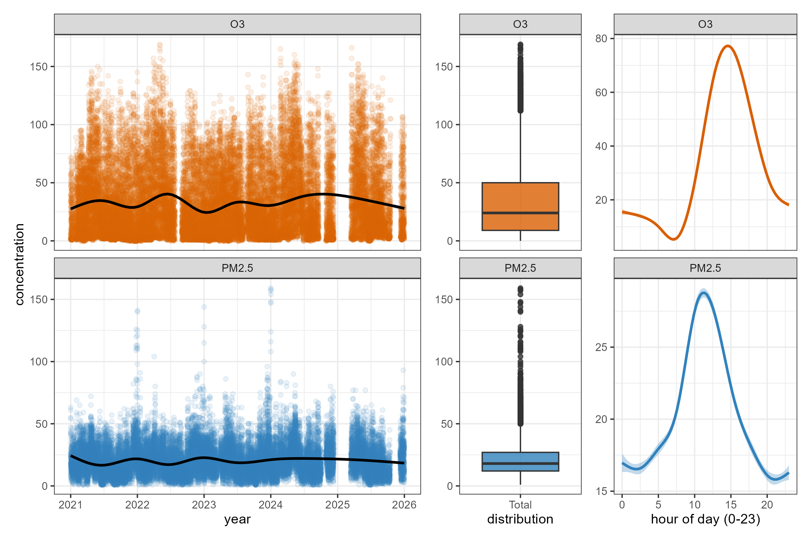
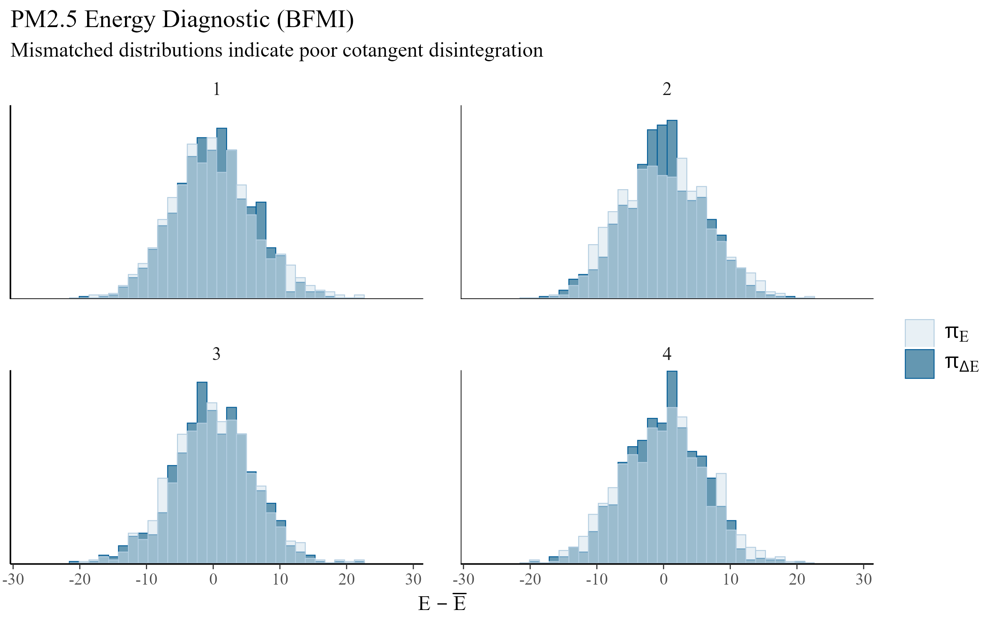
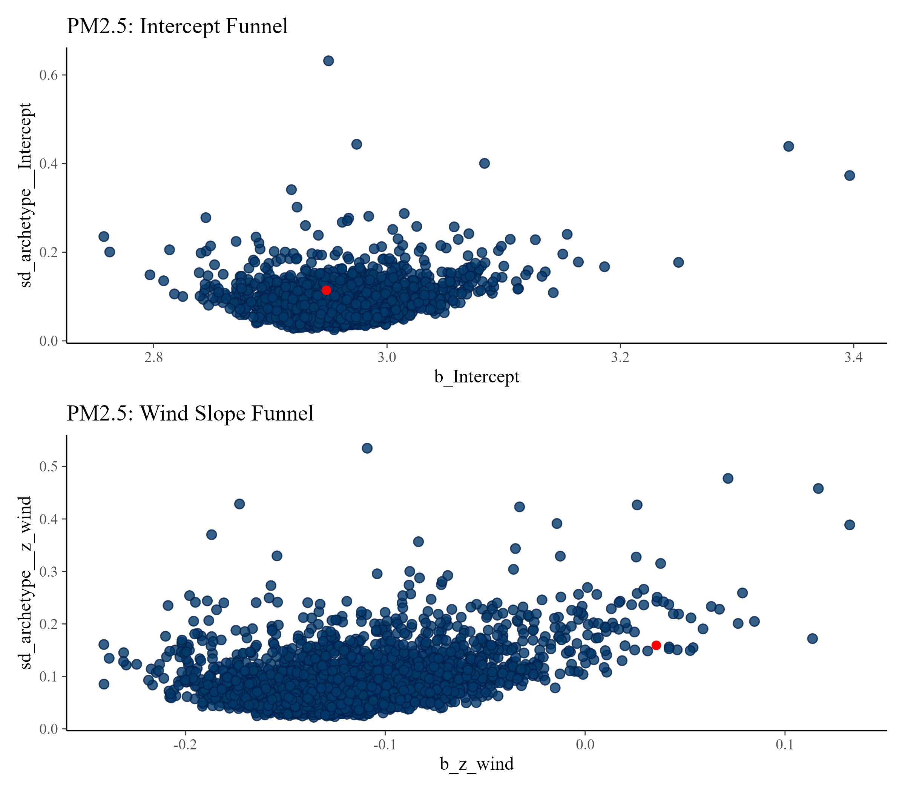
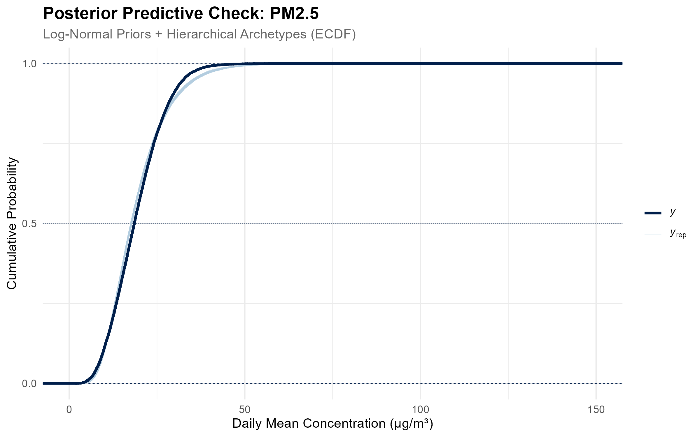
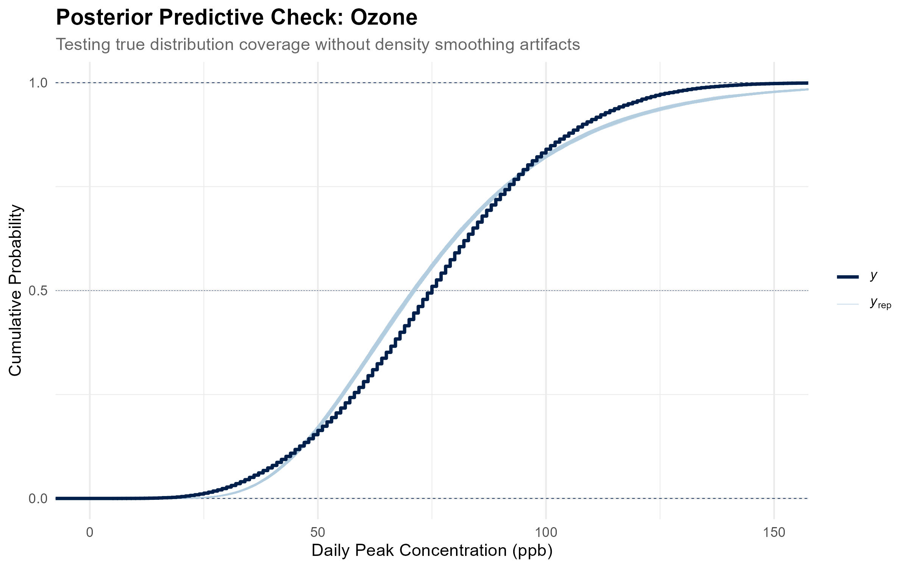

## 1. Introduction & Scope

This project is not an attempt to forecast tomorrow’s Air Quality Index or provide real-time spatial interpolation. The *Sistema de Monitoreo Atmosférico* (SIMAT) already operates a dense sensor infrastructure, and platforms like Google Maps are far better suited for real-time tracking across sparse geographical areas. 

Rather, I seek to understand the physical realities of the air we breathe in Mexico City. My goal is to provide actionable, structural insights for residents who want to know how everyday factors—like a hot afternoon, a cold weekend, or a windy morning—actually dictate the toxicity of their specific environment.

To answer these questions using SIMAT's public data, this analysis employs Generative Bayesian Modeling via Stan and `brms`. I chose this framework because Bayesian models are exceptionally good at handling complex, interacting physical constraints transparently. By explicitly modeling the relationships between altitude, temperature, wind, and human commuting patterns, this analysis maps the basin's macro-dynamics.

---

## 2. Redefining the Spatial Geography

The *Sistema de Monitoreo Atmosférico* (SIMAT) classifies its stations using *Zonas Climáticas Urbanas* (ZCU). However, ZCUs measure micro-meteorology—specifically surface roughness, building height, and localized heat islands within a 500-meter radius. 

While excellent for sensor calibration, these micro-climates are insufficient for modeling macro-atmospheric phenomena like the photochemical production of Ozone or the basin-wide flushing of PM2.5. I therefore abandoned the default political boundaries and micro-scales, re-mapping the 34 RAMA stations into five **Urban Environments**. 

To do this, I manually audited the metadata for each station using SIMAT's [Caracterización del Entorno Físico report (2021)](http://www.aire.cdmx.gob.mx/descargas/publicaciones/simat-entornos.pdf). I extracted three specific physical constraints for each site: *Topografía del relieve* (Valley vs. Mountain), *Zona Climática Urbana* (ZCU 1-7), and *Densidad del tráfico* (Local Traffic Density). By synthesizing these physical realities, I grouped the stations into the following macro-regional basins:

1. **The Industrial Flatlands** (*Plancha Industrial*): The heavily paved, factory-dense north. Stations like Xalostoc (XAL) and Tlalnepantla (TLA), characterized by *Valle* topography, high diesel traffic, and proximity to industrial corridors.
2. **The Urban Core** (*Núcleo Urbano*): The high-density commercial/residential center. Stations like Merced (MER) and Benito Juárez (BJU), featuring ZCU 2 and 3 classifications (high-density concrete) and unyielding traffic.
3. **The Highland Periphery** (*Periferia Verde*): The semi-rural, vegetated mountain slopes. Stations like Ajusco Medio (AJM) and Cuajimalpa (CUA), characterized by *Montaña* topography, ZCU 6/7, and high vegetative cover.
4. **The Eastern Sprawl** (*Expansión Oriental*): The mixed-density residential expansion, such as FES Aragón (FAR) and Chalco (CHO), located in medium-density valleys with distinct wind fetches.
5. **The Photochemical Basin** (*Trampa Fotoquímica*): Topographic bottlenecks in the south/southwest, like Pedregal (PED), where prevailing northern winds are thought to deposit chemical precursors against the mountains.

---

## 3. Data Engineering & Imputation Cascade

I extracted 5 years of hourly data (2021-2025) from two primary networks. Pollutant concentrations were pulled from the [Red Automática de Monitoreo Atmosférico (RAMA)](http://www.aire.cdmx.gob.mx/default.php?opc=%27aKBhnmI=%27&opcion=Zg==), while meteorological parameters were sourced directly from the [Red de Meteorología y Radiación Solar (REDMET)](http://www.aire.cdmx.gob.mx/default.php?opc=%27aKBi%27).

To evaluate the observational contrast of commuter traffic, I scraped the historical school calendars from the [Secretaría de Educación Pública (SEP)](https://www.planeacion.sep.gob.mx/CalendarioHistorico.aspx) to build a custom school calendar for the 2021-2025 period, flagging active school days versus holidays and weekends.

### 3.1 The Biological Reality Fix
Human lungs react differently to different pollutants. During the Exploratory Data Analysis phase, the temporal distributions of the two pollutants dictated entirely different aggregation strategies:



*   **PM2.5** builds up as a cumulative smog. Unlike Ozone, its baseline remains elevated throughout the night, making the **24-hour arithmetic mean** the most biologically relevant metric. I adhered strictly to [SIMAT's 75% rule](https://aire.cdmx.gob.mx/descargas/Opendata/catalogos/calculo-promedio-24-horas.pdf), requiring at least 18 valid hourly readings per day to calculate a valid mean.
*   **Ozone** follows a severe diurnal photolytic cycle (visible in the far-right plot), dropping to its lowest in the early morning (about 5 ppb at its minimum) and rising sharply in the afternoon. Averaging Ozone over 24 hours destroys the signal; therefore, I extracted the **daily maximum peak**, as Ozone operates on an acute threshold-toxicity basis.

### 3.2 The Imputation Cascade (The Missing-Indicator Method)
Prior to imputation, meteorological telemetry was missing for a significant portion of our valid pollutant days. The `is_imputed_met` flag marks the rows rescued by this process. This is a day-level flag that triggers `TRUE` when any single hour that day lacked a raw temperature, wind, or RH reading.

| Season | PM2.5 (Valid) | PM2.5 (Rescued) | Ozone (Valid) | Ozone (Rescued) |
| :--- | :--- | :--- | :--- | :--- |
| **Seca-Fria** | 4,865 | 3,206 | 7,803 | 7,625 |
| **Seca-Calida** | 3,674 | 2,403 | 5,947 | 6,344 |
| **Lluvias** | 5,259 | 3,686 | 9,001 | 10,156 |

Dropping these rows (a "complete-case analysis") can bias the results if the units with missing values differ systematically from the completely observed cases. 

Rather than discarding roughly 40% of the PM2.5 station-days and 50% of the Ozone station-days, I applied an adaptation of the Missing-Indicator Method. I replaced the missing values with same-hour values from stations in the same environment, and added an explicit boolean flag (`is_imputed_met`) to the Bayesian model. 

1.  **Temporal Bridge:** Missing gaps of 1-3 hours were interpolated locally.
2.  **Environment Average:** If a sensor failed for a full day, I borrowed the mean temperature, wind, and humidity from the other sensors within the same Urban Environment.
3.  **City Average:** As a last resort, I used the basin-wide average.

```r
# Level 1: Temporal Bridge (1-3 hours local interpolation)
data = data %>%
  arrange(id_station, id_parameter, datetime) %>%
  group_by(id_station, id_parameter) %>%
  mutate(across(c(TMP, WSP, RH), ~ zoo::na.approx(.x, maxgap = 3, na.rm = FALSE))) %>%
  ungroup()

# Level 2 & 3: Environment Average and City Average
arch_hourly = data %>%
  group_by(date_day, hour, archetype) %>%
  summarize(z_TMP = mean(TMP, na.rm=TRUE), z_WSP = mean(WSP, na.rm=TRUE), z_RH = mean(RH, na.rm=TRUE), .groups = "drop")

city_hourly = data %>%
  group_by(date_day, hour) %>%
  summarize(c_TMP = mean(TMP, na.rm=TRUE), c_WSP = mean(WSP, na.rm=TRUE), c_RH = mean(RH, na.rm=TRUE), .groups = "drop")

# Cascade the Fills
data = data %>%
  left_join(arch_hourly, by = c("date_day", "hour", "archetype")) %>%
  left_join(city_hourly, by = c("date_day", "hour")) %>%
  mutate(
    TMP = coalesce(TMP, z_TMP, c_TMP),
    WSP = coalesce(WSP, z_WSP, c_WSP),
    RH  = coalesce(RH, z_RH, c_RH)
  )
```

The indicator flag absorbs average differences on borrowed days, but a single deterministic fill doesn't propagate imputation uncertainty, so temperature and wind slopes are probably somewhat attenuated and their intervals optimistic.

### 3.3 Statistical Process Control (SPC)
Air quality monitors occasionally transmit physically impossible telemetry. To prevent sensor malfunction spikes from skewing the hierarchical slopes, I passed the data through a Statistical Process Control (SPC) filter. To prevent extreme outliers from stretching the control limits, I utilized a robust control chart methodology based on the Interquartile Range, as demonstrated by <span title="Rocke, D. M. (1989). Robust control charts. Technometrics, 31(2), 173-184." style="border-bottom: 1px dotted #888; cursor: help;">David Rocke (1989)</span>. 

The filter works per station × pollutant × hour on a rolling window of the current plus up to 29 previous valid days. It flags values outside $Q1 - 1.5 \cdot IQR$ and $Q3 + 1.5 \cdot IQR$.

Flagged hours are removed before daily aggregation, which also removes their concurrent weather from the daily maximum calculations. While this effectively removes glitches, it can also trim real short peaks, and the ozone posterior predictive check's lighter observed upper tail is consistent with that truncation. The filter flagged 17,462 hours (3.2% of hours entering the filter) for PM2.5 and 40,028 hours (3.6%) for Ozone.

### 3.4 Feature Standardization
To facilitate Hamiltonian Monte Carlo convergence, all continuous physical predictors were standardized into Z-scores ($z = \frac{x - \mu}{\sigma}$). Temperature was defined as the daily maximum (max of hourly values), while wind and relative humidity were defined as daily means. Z-scores were computed separately within each pollutant's dataset.

The final marginal effects reported in the auditor table are back-transformed into their natural physical units. The transformations use each pollutant's own mean and standard deviation. Specifically, the estimates are the average change from a +1 SD shift divided by the SD, which gives approximate average slopes per unit.

---

## 4. Bayesian Architecture

Pollutant concentrations are strictly positive and possess long right tails. I therefore modeled the data using a log-normal data-generating process:

$$Y_i \sim \text{LogNormal}(\mu_i, \sigma)$$
$$\mu_i = \alpha_{j[i]} + \mathbf{X}_i \boldsymbol{\beta} + \mathbf{Z}_i \boldsymbol{\gamma}_{j[i]}$$

Where $\alpha_{j[i]}$ represents the varying baseline intercept for each of the 5 Urban Environments, $\mathbf{X}_i \boldsymbol{\beta}$ contains the fixed population-level effects, and $\mathbf{Z}_i \boldsymbol{\gamma}_{j[i]}$ represents the hierarchically varying slopes for temperature and wind across the different environments.

I built the models progressively—from a base varying-intercept model, to a linear varying-slope model, to the final interaction model—to explicitly test the following:

*   **Ozone (The Heat Catalyst):** $\beta (\text{School\_Day}_i \times \text{Temp}_i)$. This tests whether the effect of the school-day commute varies with the daily maximum temperature.
*   **PM2.5 (The Wind Scrubber):** $\beta (\text{Season}_i \times \text{Wind}_i)$. This tests whether the flushing effect of the wind varies by season.

```r
# Decoupled Priors for Lognormal Baselines
pm25_priors = c(
  prior(normal(3.1, 0.2), class = "Intercept"), # Calibrated for 24h Mean
  prior(normal(0, 0.1),   class = "b"),
  prior(exponential(5),   class = "sd"),
  prior(normal(0, 0.2),   class = "sigma", lb = 0)
)

o3_priors = c(
  prior(normal(4.3, 0.3), class = "Intercept"), # Calibrated for Peak
  prior(normal(0, 0.1),   class = "b"),
  prior(exponential(5),   class = "sd"),
  prior(normal(0, 0.2),   class = "sigma", lb = 0)
)

# Terminal Interaction Model (Ozone)
m_o3_interaction = brm(
  formula = daily_metric ~ season + is_school_day * z_temp + is_holiday + is_imputed_met + 
    z_alt + z_wind + z_rh +
    (1 + z_temp + z_wind | archetype),
  data = o3_data,
  family = lognormal(), 
  prior = o3_priors, 
  chains = 4, cores = 4,
  iter = 2000, warmup = 1000, seed = 123,
  control = list(adapt_delta = 0.99), 
  backend = 'cmdstanr'
)

# Terminal Interaction Model (PM2.5)
m_pm25_interaction = brm(
  formula = daily_metric ~ season * z_wind + is_school_day + is_holiday + is_imputed_met + 
    z_alt + z_temp + z_rh +
    (1 + z_temp + z_wind | archetype),
  data = pm25_data,
  family = lognormal(), 
  prior = pm25_priors, 
  chains = 4, cores = 4,
  iter = 2000, warmup = 1000, seed = 123,
  control = list(adapt_delta = 0.99), 
  backend = 'cmdstanr'
)
```

---

## 5. Hamiltonian Monte Carlo Diagnostics

The terminal models compiled cleanly, running 4 chains of 2,000 iterations. The diagnostic parameters confirm reliable Markov chain Monte Carlo estimation. For both models, every parameter achieved an $\hat{R} \le 1.01$ convergence metric. The Effective Sample Sizes comfortably exceeded the 400-draw threshold required for stable posterior inference, with the `Bulk_ESS` ranging from 1,163 to over 8,000 across parameters. The BFMI (Bayesian Fraction of Missing Information) energy diagnostics confirmed efficient exploration of the parameter space, with values ranging from 0.79 to 0.93 across all chains.

### 5.1 Divergent Transitions
During the sampling of the PM2.5 interaction model, the backend reported a single divergent transition in 4,000 post-warmup draws. The Ozone model sampled flawlessly with zero divergences.

As noted by <span title="Betancourt, M. (2018). A conceptual introduction to Hamiltonian Monte Carlo. arXiv preprint arXiv:1701.02434." style="border-bottom: 1px dotted #888; cursor: help;">Michael Betancourt (2018)</span>, a confluence of pathologies "is advantageous in practice because we can use the easily-observed divergences to identify the more subtle statistical pathologies." To determine whether the single PM2.5 divergence represented a trapped sampler, I mapped the energy distributions and hierarchical funnels:




Looking at the funnel checks, the single PM2.5 divergence sits in the sparse upper tail of the wind-slope plot ($b\_z\_wind \approx +0.03$), not at the funnel neck, and remains hidden inside the dense cloud on the intercept plot. This is an isolated event in a sparse region, not a cluster at low variance. While a single divergence in the PM2.5 model isn't alarming by itself, mild geometry in the wind slope isn't ruled out.

### 5.2 Posterior Predictive Checks (ECDF)
Because pollutant concentrations are Log-Normal, I utilized Empirical Cumulative Distribution Function (ECDF) overlays for the posterior predictive checks to avoid density smoothing artifacts.




The ECDF confirms PM2.5 fits closely, with a slightly heavier predicted upper tail. Ozone captures the overall shape but sits about 4–5 ppb low around the median and predicts a heavier upper tail than observed, so absolute ppb values are approximate.

---

## 6. Limitations

*   **Non-independence:** Station-days are treated as conditionally independent. There are no station or date terms, though stations share weather days and the school-day metric varies only by date. Therefore, the credible intervals are likely optimistic.
*   **Commuting Proxy:** The school calendar is utilized as a proxy for weekday commuting, which is inherently entangled with vacation seasonality. 
*   **Imputation & Filtering:** As detailed in Section 3, the deterministic meteorological imputation likely attenuates slopes, and the IQR anomaly filter clips genuine physical extremes.
*   **Unobserved Covariates:** There is no solar radiation, cloud cover, or continuous wind-direction data in the model, meaning statements regarding photochemistry and directional transport are interpretive mechanisms rather than direct observations.
*   **Crossover Point Estimate:** The temperature threshold where school traffic's association with ozone reverses, reported in the visual findings, is a point estimate. The model's interval explicitly excludes zero only below roughly 27°C and above roughly 33°C.
*   **Reference Baseline:** The "Typical Day" environment baseline calculated in the visualizations is defined by holding continuous covariates at their mean and categorical values at their mode. Specifically, the reference condition evaluates a standard, non-holiday school day during the Rainy season (*Lluvias*). Continuous physical variables are held precisely at their dataset means: a daily maximum temperature of approximately 22.4°C, a daily mean wind speed of 2.0 m/s, a relative humidity of 48-50%, and an average station altitude of ~2,340 meters.

---

## 7. The Auditor Table

To provide full transparency on the raw mathematical slopes, the un-scaled marginal effects derived via `marginaleffects::avg_comparisons()` are provided below. All continuous variables have been back-transformed from standard deviations to physical, natural units. 

The intervals are 95% posterior credible intervals (equal-tailed by default). Note that "Excludes Zero" does not imply the magnitude of the effect is certain, given the limitations discussed in Section 6. The data shows wind (roughly −12 ppb per m/s) and heat (roughly +1.6 ppb per °C) are associated with the largest shifts in peak ozone.

The holiday and school day metrics are mutually exclusive indicators, both compared against weekends and breaks. Calculations are based on a random sample of 1,000 days per pollutant (seed 123).

```{r}
#| echo: false
#| message: false
#| eval: true
library(tidyverse)
library(knitr)

read_csv("plots/final/04_auditor_effects_table_1k_sample.csv") %>%
  select(
    Pollutant,
    Driver,
    `Absolute Shift` = Absolute_Shift,
    `95% CI Lower` = `95%_CI_Lower`,
    `95% CI Upper` = `95%_CI_Upper`,
    `Credible Interval Status` = Credible_Interval_Status
  ) %>%
  mutate(across(where(is.numeric), 
                ~ if_else(.x < 0, 
                          paste0("<span style='color: firebrick;'>", .x, "</span>"), 
                          as.character(.x)))) %>%
  kable(escape = FALSE, format = "html", align = c("l", "l", "r", "r", "r", "l"))
```

---

## 8. Computing Environment

The data harmonization, spatial engineering, and Hamiltonian Monte Carlo sampling were executed using the following core infrastructure:

*   **R Version:** 4.5.1
*   **brms:** 2.23.0 (Bayesian Regression Models using Stan)
*   **cmdstanr:** 0.9.0 (Lightweight R interface to CmdStan)
*   **marginaleffects:** 1.0.0 (Marginal effects and contrasts for complex models)
*   **bayesplot:** 1.16.0 (Plotting Bayesian models)
*   **tidyverse:** 2.0.0 (Data engineering and grammar of graphics)
*   **patchwork:** 1.3.2 (Plot composition and alignment)
*   **slider:** 0.3.3 (Rolling window functions for Statistical Process Control)

*(End of Appendix)*