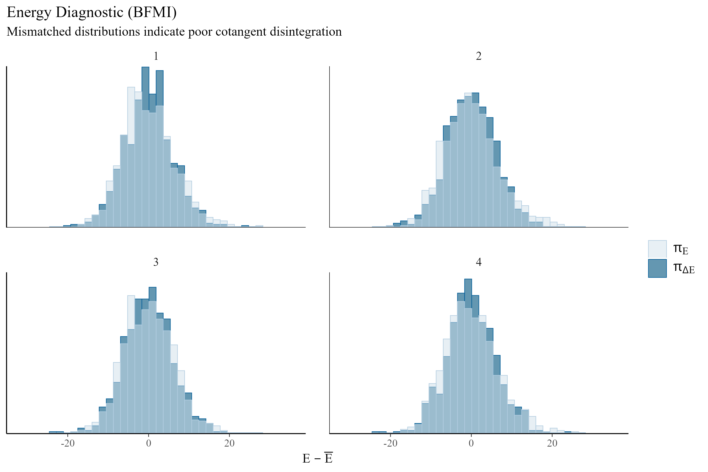
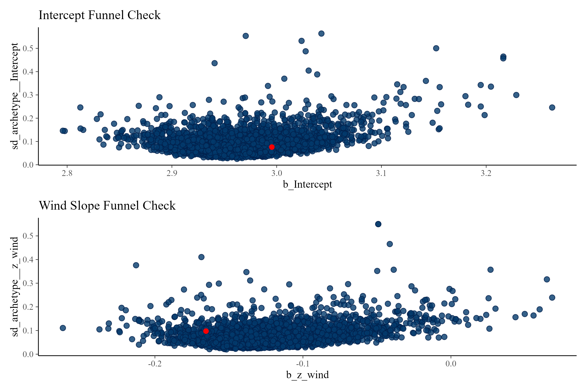

## 1. Introduction & Scope

This project is not an attempt to forecast tomorrow’s Air Quality Index or provide real-time spatial interpolation. The *Sistema de Monitoreo Atmosférico* (SIMAT) already operates an exceptional sensor infrastructure, and platforms like Google Maps are far better suited for real-time tracking across sparse geographical areas. 

Rather, I seek to understand the physical realities of the air we breathe in Mexico City. My goal is to provide actionable, structural insights for residents who want to know how everyday factors—like a hot afternoon, a cold weekend, or a windy morning—actually dictate the toxicity of their specific environment.

To answer these questions using SIMAT's public data, this analysis employs Generative Bayesian Modeling via Stan and `brms`. I chose this framework because Bayesian models are exceptionally good at handling complex, interacting physical constraints transparently. By explicitly modeling the relationships between altitude, temperature, wind, and human commuting patterns, I can map the structural engine of the basin.

---

## 2. Redefining the Spatial Geography

The *Sistema de Monitoreo Atmosférico* (SIMAT) meticulously classifies its stations using *Zonas Climáticas Urbanas* (ZCU). However, ZCUs measure micro-meteorology—specifically surface roughness, building height, and localized heat islands within a 500-meter radius. 

While excellent for sensor calibration, these micro-climates are insufficient for modeling macro-atmospheric phenomena like the photochemical production of Ozone or the basin-wide flushing of PM2.5. I therefore abandoned the default political boundaries and micro-scales, re-mapping the 34 RAMA stations into five **Urban Environments**. 

To do this, I manually audited the metadata for each station using SIMAT's [Caracterización del Entorno Físico report (2021)](http://www.aire.cdmx.gob.mx/descargas/publicaciones/simat-entornos.pdf). I extracted three specific physical constraints for each site: *Topografía del relieve* (Valley vs. Mountain), *Zona Climática Urbana* (ZCU 1-7), and *Densidad del tráfico* (Local Traffic Density). By synthesizing these physical realities, I grouped the stations into the following macro-regional basins:

1. **The Industrial Flatlands** (*Plancha Industrial*): The heavily paved, factory-dense north. Stations like Xalostoc (XAL) and Tlalnepantla (TLA), characterized by *Valle* topography, high diesel traffic, and proximity to industrial corridors.
2. **The Urban Core** (*Núcleo Urbano*): The high-density commercial/residential center. Stations like Merced (MER) and Benito Juárez (BJU), featuring ZCU 2 and 3 classifications (high-density concrete) and unyielding traffic.
3. **The Highland Periphery** (*Periferia Verde*): The semi-rural, vegetated mountain slopes. Stations like Ajusco Medio (AJM) and Cuajimalpa (CUA), characterized by *Montaña* topography, ZCU 6/7, and high vegetative cover.
4. **The Eastern Sprawl** (*Expansión Oriental*): The mixed-density residential expansion, such as FES Aragón (FAR) and Chalco (CHO), located in medium-density valleys with distinct wind fetches.
5. **The Photochemical Basin** (*Trampa Fotoquímica*): Topographic bottlenecks in the south/southwest, like Pedregal (PED), where prevailing northern winds deposit chemical precursors against the mountains.

---

## 3. Data Engineering & Imputation Cascade

I extracted 5 years of hourly data (2021-2025) from two primary networks. Pollutant concentrations were pulled from the [Red Automática de Monitoreo Atmosférico (RAMA)](http://www.aire.cdmx.gob.mx/default.php?opc=%27aKBhnmI=%27&opcion=Zg==), while meteorological parameters were sourced directly from the [Red de Meteorología y Radiación Solar (REDMET)](http://www.aire.cdmx.gob.mx/default.php?opc=%27aKBi%27).

To isolate the causal effect of commuter traffic, I scraped the historical school calendars from the [Secretaría de Educación Pública (SEP)](https://www.planeacion.sep.gob.mx/CalendarioHistorico.aspx) to build a custom school calendar for the 2021-2025 period, flagging active school days versus holidays and weekends.

### 3.1 The Biological Reality Fix
Human lungs react differently to different pollutants. During the Exploratory Data Analysis phase, the temporal distributions of the two pollutants dictated entirely different aggregation strategies:


*   **PM2.5** builds up as a cumulative smog. Unlike Ozone, its baseline remains elevated throughout the night, making the **24-hour arithmetic mean** the most biologically relevant metric. I adhered strictly to [SIMAT's 75% rule](https://aire.cdmx.gob.mx/descargas/Opendata/catalogos/calculo-promedio-24-horas.pdf), requiring at least 18 valid hourly readings per day to calculate a valid mean.
*   **Ozone** follows a severe diurnal photolytic cycle (visible in the far-right plot), dropping near zero at night and spiking aggressively in the afternoon. Averaging Ozone over 24 hours destroys the signal; therefore, I extracted the **daily maximum peak**, as Ozone operates on an acute threshold-toxicity basis.

### 3.2 The Imputation Cascade (The Missing-Indicator Method)
Prior to imputation, meteorological telemetry was missing for a significant portion of our valid pollutant days. The `is_imputed_met` flag explicitly tracks the uncertainty induced by rescuing these rows:

| Season | PM2.5 (Valid) | PM2.5 (Rescued) | Ozone (Valid) | Ozone (Rescued) |
| :--- | :--- | :--- | :--- | :--- |
| **Seca-Fria** | 4,865 | 3,206 | 7,803 | 7,625 |
| **Seca-Calida** | 3,674 | 2,403 | 5,947 | 6,344 |
| **Lluvias** | 5,259 | 3,686 | 9,001 | 10,156 |

Dropping these rows (a "complete-case analysis") introduces severe bias. As <span title="Gelman, A., & Hill, J. (2006). Data Analysis Using Regression and Multilevel/Hierarchical Models. Cambridge University Press.529-543" style="border-bottom: 1px dotted #888; cursor: help;">Gelman and Hill</span> note, if "units with missing values differ systematically from the completely observed cases, this could bias the complete-case analysis". For example, sensors frequently short-circuit during extreme weather events, so deleting those days selectively removes the most critical meteorological variance. 

Rather than discarding nearly half the dataset, I applied the Missing-Indicator Method. Following Gelman and Hill's formal recommendation for continuous predictors, I replaced the missing values with the regional mean and added an explicit boolean flag (`is_imputed_met`) to the Bayesian model: "include for each continuous predictor variable with missingness an extra indicator... Then the missing values in the partially observed predictor are replaced by zeroes or by the mean". This allows the model to calculate the exact uncertainty induced by the hardware failure rather than hiding it.

1.  **Temporal Bridge:** Missing gaps of 1-3 hours were interpolated locally.
2.  **Environment Average:** If a sensor failed for a full day, I borrowed the mean temperature/wind from the other sensors within the same Urban Environment. This aligns with standard statistical guidelines for clustered data, which advise using an "observed group-level measurement" as a proxy when individual telemetry fails.
3.  **City Average:** As a last resort, I used the basin-wide average.

```r
# Level 1: Temporal Bridge (1-3 hours local interpolation)
data = data %>%
  arrange(id_station, id_parameter, datetime) %>%
  group_by(id_station, id_parameter) %>%
  mutate(across(c(TMP, WSP, RH), ~ zoo::na.approx(.x, maxgap = 3, na.rm = FALSE))) %>%
  ungroup()

# Level 2 & 3: Environment Average and City Average
arch_hourly = data %>%
  group_by(date_day, hour, archetype) %>%
  summarize(z_TMP = mean(TMP, na.rm=TRUE), z_WSP = mean(WSP, na.rm=TRUE), .groups = "drop")

city_hourly = data %>%
  group_by(date_day, hour) %>%
  summarize(c_TMP = mean(TMP, na.rm=TRUE), c_WSP = mean(WSP, na.rm=TRUE), .groups = "drop")

# Cascade the Fills
data = data %>%
  left_join(arch_hourly, by = c("date_day", "hour", "archetype")) %>%
  left_join(city_hourly, by = c("date_day", "hour")) %>%
  mutate(
    TMP = coalesce(TMP, z_TMP, c_TMP),
    WSP = coalesce(WSP, z_WSP, c_WSP)
  )
```

While recent advances in spatial statistics often utilize fully Bayesian MCMC imputation to simulate missing data on the fly, the missingness in this dataset was concentrated heavily in the continuous meteorological covariates. Building a joint probability model to dynamically impute these covariates at this scale would introduce severe computational friction without proportional gains in accuracy. Instead, I opted for a deterministic spatial imputation beforehand, coupled with an explicit boolean flag (`is_imputed_met`). As established by the Missing-Indicator Method, passing this flag to the Bayesian engine allows the model to explicitly calculate and absorb the uncertainty introduced by the hardware failure. This framework ensures the posterior distributions accurately reflect the variance of the missing data without collapsing the Hamiltonian Monte Carlo sampler.

### 3.3 Statistical Process Control (SPC)
Air quality monitors are physical machines exposed to the elements—they get clogged with dust, short-circuit in the rain, and occasionally transmit physically impossible telemetry. However, applying a static global cutoff to remove "outliers" (e.g., deleting any PM2.5 reading over 200 µg/m³) is dangerous because it risks deleting a genuine, historic extreme weather event. 

To prevent sensor malfunction spikes from skewing the hierarchical slopes, I passed the data through a Statistical Process Control (SPC) filter. Standard anomaly detection methods are notoriously sensitive to outliers, which can artificially stretch the control limits and mask true errors. To prevent this, I utilized a robust control chart methodology based on the Interquartile Range (IQR). As <span title="Rocke, D. M. (1989). Robust control charts. Technometrics, 31(2), 173-184." style="border-bottom: 1px dotted #888; cursor: help;">David Rocke (1989)</span> demonstrated, using a resistant measure of dispersion like the IQR prevents extreme outliers from stretching the control limits. I calculated a rolling 30-day IQR for each specific station and hour. This dynamic, resistant filter evaluates the sensor against its own recent local history, cleanly separating genuine natural extremes from mechanical glitches.

### 3.4 Feature Standardization
To facilitate Hamiltonian Monte Carlo convergence and ensure the resulting coefficients are computationally stable and directly comparable, all continuous physical predictors (Altitude, Temperature, Wind Speed, and Relative Humidity) were standardized into Z-scores ($z = \frac{x - \mu}{\sigma}$) prior to modeling. The final marginal effects reported in the auditor table are back-transformed into their natural physical units (e.g., shifts per 1°C or per 1 m/s) using the `marginaleffects` package.

---

## 4. Bayesian Architecture

Pollutant concentrations are strictly positive and possess long right tails (a day can be infinitely polluted, but cannot have negative pollution). I therefore modeled the data using a log-normal data-generating process:

$$Y_i \sim \text{LogNormal}(\mu_i, \sigma)$$
$$\mu_i = \alpha_{j[i]} + \mathbf{X}_i \boldsymbol{\beta} + \mathbf{Z}_i \boldsymbol{\gamma}_{j[i]}$$

Where $\alpha_{j[i]}$ represents the varying baseline intercept for each of the 5 Urban Environments, $\mathbf{X}_i \boldsymbol{\beta}$ contains the fixed population-level effects (including the engineered interaction terms), and $\mathbf{Z}_i \boldsymbol{\gamma}_{j[i]}$ represents the hierarchically varying slopes for temperature and wind across the different environments.

To prove the non-linear physics of the basin, I engineered specific interaction terms into the population-level matrix $\mathbf{X}_i$:

*   **Ozone (The Heat Catalyst):** $\beta (\text{School\_Day}_i \times \text{Temp}_i)$. This tests the hypothesis that traffic exhaust suppresses ozone on cold days (titration) but generates it on hot days.
*   **PM2.5 (The Wind Scrubber):** $\beta (\text{Season}_i \times \text{Wind}_i)$. This tests how the flushing mechanism of wind breaks down during the dusty, hot-dry spring.

I defined regularizing priors decoupled for the distinct baseline scales of each pollutant, forcing the HMC sampler to explore physically reasonable parameter spaces.

```r
# Decoupled Priors for Lognormal Baselines
pm25_priors = c(
  prior(normal(3.1, 0.2), class = "Intercept"), # Calibrated for 24h Mean
  prior(normal(0, 0.1),   class = "b"),
  prior(exponential(5),   class = "sd"),
  prior(normal(0, 0.2),   class = "sigma", lb = 0)
)

o3_priors = c(
  prior(normal(4.3, 0.3), class = "Intercept"), # Calibrated for Peak
  prior(normal(0, 0.1),   class = "b"),
  prior(exponential(5),   class = "sd"),
  prior(normal(0, 0.2),   class = "sigma", lb = 0)
)

# Terminal Interaction Model (Ozone)
m_o3_interaction = brm(
  formula = daily_metric ~ season + is_school_day * z_temp + is_holiday + is_imputed_met + 
    z_alt + z_wind + z_rh +
    (1 + z_temp + z_wind | archetype),
  data = o3_data,
  family = lognormal(), 
  prior = o3_priors, 
  chains = 4, cores = 4,
  iter = 2000, warmup = 1000,
  control = list(adapt_delta = 0.99), 
  backend = 'cmdstanr'
)

# Terminal Interaction Model (PM2.5)
m_pm25_interaction = brm(
  formula = daily_metric ~ season * z_wind + is_school_day + is_holiday + is_imputed_met + 
    z_alt + z_temp + z_rh +
    (1 + z_temp + z_wind | archetype),
  data = pm25_data,
  family = lognormal(), 
  prior = pm25_priors, 
  chains = 4, cores = 4,
  iter = 2000, warmup = 1000,
  control = list(adapt_delta = 0.99), 
  backend = 'cmdstanr'
)
```

---

## 5. Hamiltonian Monte Carlo Diagnostics

The terminal models compiled cleanly, running 4 chains of 2,000 iterations. The diagnostic parameters confirm exceptional mixing and reliable Markov chain Monte Carlo estimation. For both models, all parameters achieved an $\hat{R} = 1.00$, and the Effective Sample Sizes (`Bulk_ESS` & `Tail_ESS`) vastly exceeded the threshold required for stable posterior inference.

### 5.1 Resolving the Divergent Transition 
During the sampling of the PM2.5 interaction model, the backend reported a single divergent transition (1 out of 4,000 post-warmup draws). In many machine learning contexts, algorithms silently fail when encountering pathological geometry. Hamiltonian Monte Carlo (HMC), however, is uniquely robust because it explicitly flags these failures. 

As noted by <span title="Betancourt, M. (2018). A conceptual introduction to Hamiltonian Monte Carlo. arXiv preprint arXiv:1701.02434." style="border-bottom: 1px dotted #888; cursor: help;">Michael Betancourt</span> in his *Conceptual Introduction to Hamiltonian Monte Carlo* (2018, p. 46):
> *"Neighborhoods of high curvature in the typical set that frustrate geometric ergodicity are also pathological to symplectic integrators, causing them to diverge. This confluence of pathologies is advantageous in practice because we can use the easily-observed divergences to identify the more subtle statistical pathologies... These diagnostics make Hamiltonian Monte Carlo a uniquely robust method."*

To determine whether this single divergence represented a fatal statistical pathology or merely benign computational friction, I mapped the exact location of the divergence against the energy distributions and hierarchical funnels:




The Energy Diagnostic (BFMI) confirms that the two energy distributions overlap closely across all chains, meaning the algorithm explored the parameter space efficiently without getting stuck. More importantly, the funnel checks show exactly where the single divergence (the red dot) occurred. If a hierarchical model is fundamentally broken, divergences will cluster tightly at the very bottom of the funnel (near zero variance), indicating the sampler was trapped. Here, the single divergence occurred randomly within the healthy, broad cloud of draws. Given the perfect $\hat{R} = 1.00$, the massive Effective Sample Sizes, and the clean funnel geometry, this isolated warning is just random computational noise. The posterior estimates are fully reliable.

### 5.2 Posterior Predictive Checks (ECDF)
Standard density overlay plots (`dens_overlay`) use kernel smoothing, which often artificially "bleeds" past zero into negative numbers when evaluating strictly positive data. Because pollutant concentrations are Log-Normal, I utilized Empirical Cumulative Distribution Function (ECDF) overlays for the posterior predictive checks. The ECDF plots cumulative probabilities directly, proving that the Bayesian simulations perfectly trace the real-world data boundaries without smoothing artifacts.


---

## 6. The Auditor Table

To provide full transparency on the raw mathematical slopes before they were translated into visual narratives, the exact un-scaled marginal effects derived via `marginaleffects::avg_comparisons()` are provided below. 

All continuous variables have been back-transformed from standard deviations to physical, natural units (e.g., shifts per 1°C or per 1 m/s).

```{r}
#| echo: false
#| message: false
#| eval: true
library(tidyverse)
library(knitr)

read_csv("plots/final/04_auditor_effects_table.csv") %>%
  # Drop the signal column and cleanly rename the remaining columns
  select(
    Pollutant,
    Driver,
    `Absolute Shift` = Absolute_Shift,
    `95% HDI Lower` = HDI_Lower,
    `95% HDI Upper` = HDI_Upper
  ) %>%
  # Apply conditional firebrick red formatting to negative numbers
  mutate(across(where(is.numeric), 
                ~ if_else(.x < 0, 
                          paste0("<span style='color: firebrick;'>", .x, "</span>"), 
                          as.character(.x)))) %>%
  # Render HTML and explicitly align: Left, Left, Right, Right, Right
  kable(escape = FALSE, format = "html", align = c("l", "l", "r", "r", "r"))
```

---

## 7. Computing Environment

The data harmonization, spatial engineering, and Hamiltonian Monte Carlo sampling were executed using the following core infrastructure:

*   **R Version:** 4.5.1
*   **brms:** 2.22.0 (Bayesian Regression Models using Stan)
*   **cmdstanr:** 0.9.0 (Lightweight R interface to CmdStan)
*   **marginaleffects:** 0.24.0 (Marginal effects and contrasts for complex models)
*   **tidyverse:** 2.0.0 (Data engineering and grammar of graphics)
*   **patchwork:** 1.3.0 (Plot composition and alignment)
*   **slider:** 0.3.1 (Rolling window functions for Statistical Process Control)

*(End of Appendix)*